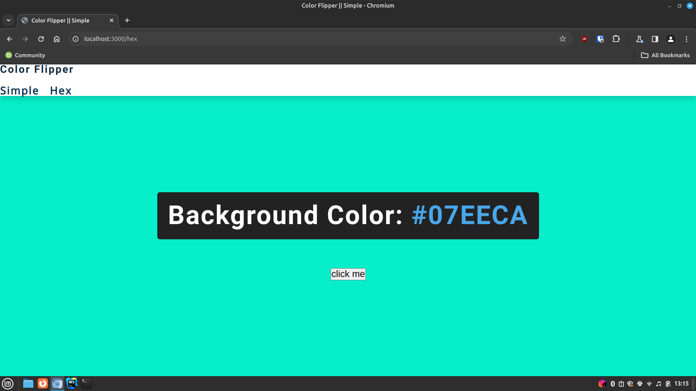

# Color Flipper 

The Color Flipper App is a simple web application that allows users to change the background color of the page by clicking a button. 
It includes two versions: 
one for simple colors and one for hex colors.

## The Color Flipper App consists of two main pages:


`index.html for simple colors.`
`hex.html for hex colors.`

Users can navigate between these two pages and use the provided buttons to change the background color of the page.


## File Structure

```
index.html: Contains the HTML structure for the simple color flipper.
hex.html: Contains the HTML structure for the hex color flipper.
app.js: Contains the JavaScript code for the simple color flipper.
hex.js: Contains the JavaScript code for the hex color flipper.
style.css: Contains the CSS styles for both versions of the app.
```

## JavaScript Functionality
`app.js`

This file contains the JavaScript code for the simple color flipper.

```javascript
const colors=["green","red","rgba(133,122.200)","#f15025" ];

const btn=document.getElementById("btn");
const color=document.querySelector(".color");

btn.addEventListener("click", function () {
        const randomNumber = getRandomNumber();
        document.body.style.backgroundColor=colors[randomNumber];
        color.textContent=colors[randomNumber];

    }
);

function getRandomNumber() {
    return Math.floor(Math.random() * colors.length);
}

```

`hex.js`

This file contains the JavaScript code for the hex color flipper.

```javascript
const hex=[0,1,2,3,4,5,6,7,8,9, "A","B","C","D","E","F"];

const btn =document.getElementById('btn');
const color =document.querySelector('.color');

btn.addEventListener('click', function (){
    let hexColor= '#';
    for(let i=0; i<6; i++){
        hexColor += hex[getRandomHexIndex()];
    }
    color.textContent=hexColor;
    document.body.style.backgroundColor=hexColor;

});

function getRandomHexIndex (){
    return Math.floor(Math.random() * hex.length)
}
```


## Usage
1. Open index.html in a web browser to use the simple color flipper.

2. Click the "click me" button to change the background color to a random simple color.

3. Open hex.html in a web browser to use the hex color flipper.

4. Click the "click me" button to change the background color to a random hex color.
  

# Application show


